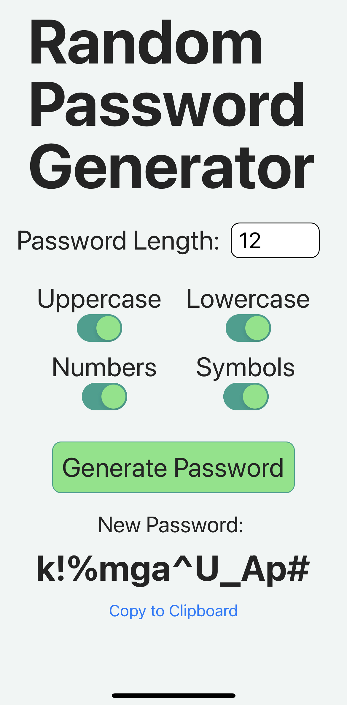

# xPass

Author: Xavier Hillman

xPass is a random password generator that can be customized to produce passwords of varying lengths and complexity.

This application was built to learn more about React Native and mobile development. It is not intended to be used in production, but rather as a learning tool and a way to generate personal passwords on the go.

## Build Status

This project is currently under incremental development. The following features are currently implemented:

- Password length selection
- Password complexity selection
- Password generation
- Password copy to clipboard

Features to implemented in the future:

- Password storage
- Password history
- Password strength meter

## Technologies Used

- React Native
- JavaScript
- Expo
